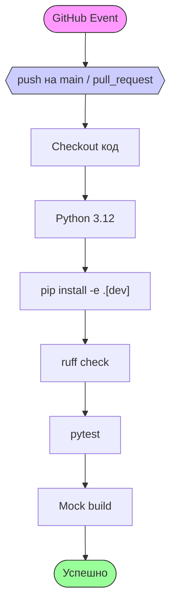

**Легенда шагов:**

| Шаг | Описание |
|-----|---------|
| **Checkout код** | Загрузка исходного кода из репозитория |
| **Python 3.12** | Установка Python 3.12 |
| **pip install** | Установка dev-зависимостей |
| **ruff check** | Проверка стиля кода |
| **pytest** | Запуск тестов |
| **Mock build** | Имитация сборки |

**Логика запуска:**

- `build` → запуск при любом `push`
- `test` → запуск только при `push` на `main`, требует успешного `build`